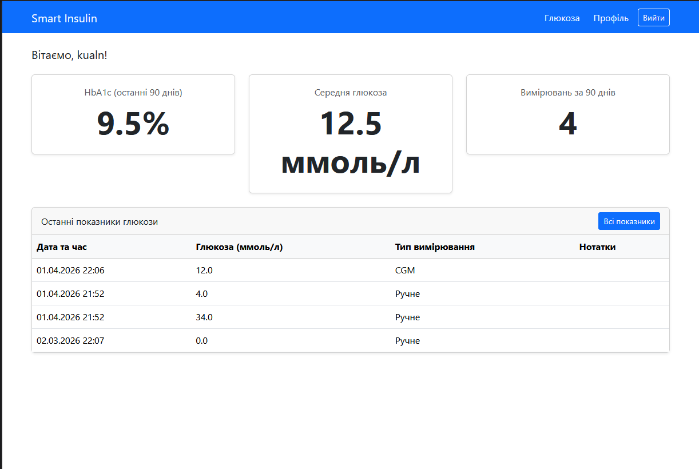
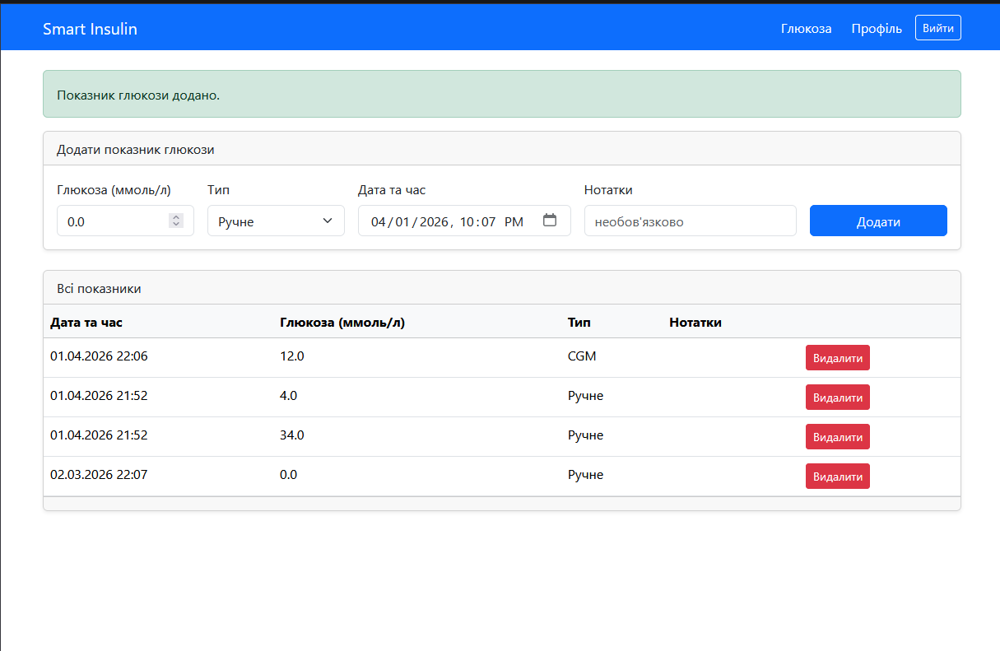
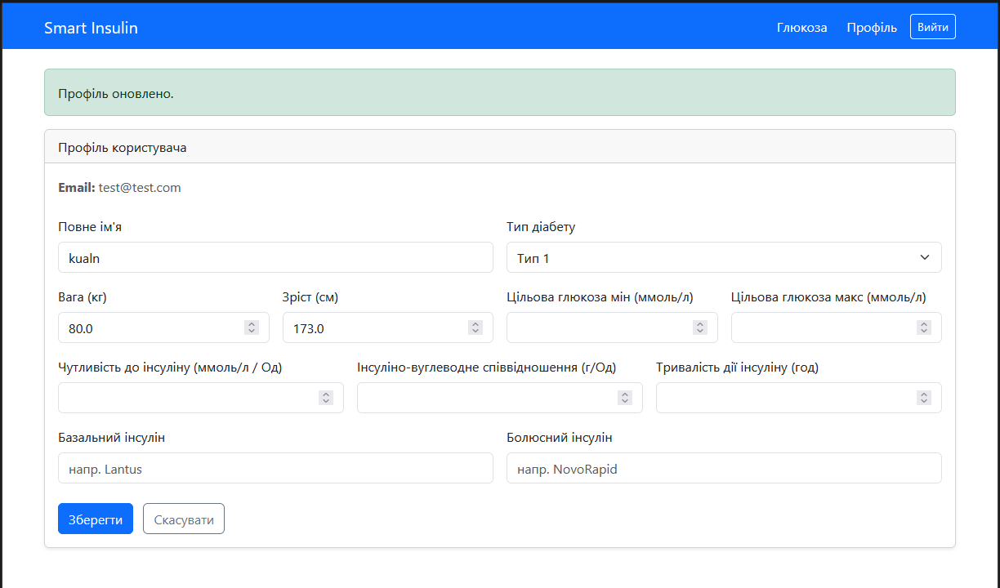
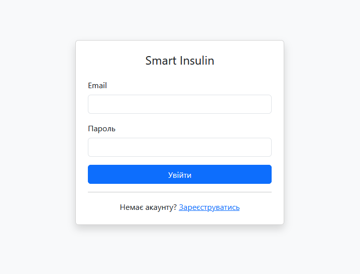
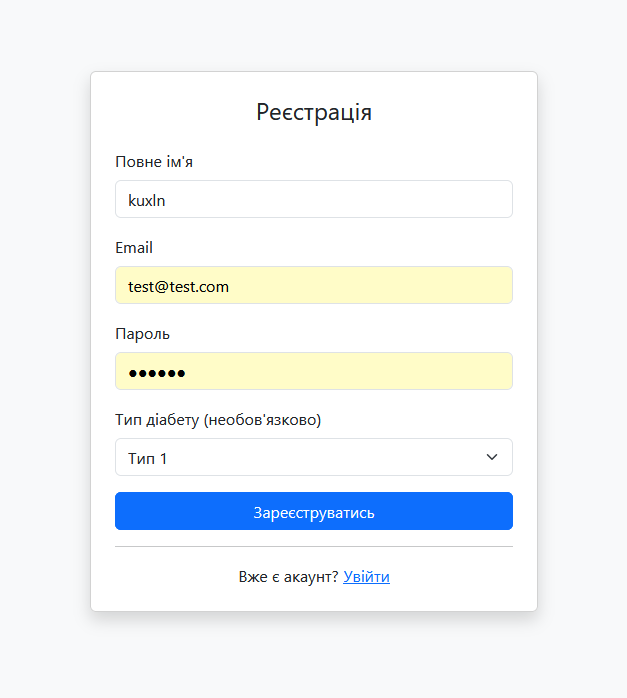

# Smart Insulin App

A Spring Boot web application for diabetes management. Tracks blood glucose levels, calculates HbA1c estimates, and stores medical profiles — all through a server-rendered Thymeleaf UI.

## Tech Stack

- **Backend:** Java 17, Spring Boot 4, Spring MVC, Spring Security (form login)
- **Database:** PostgreSQL + Flyway migrations + Spring Data JPA
- **Frontend:** Thymeleaf + Bootstrap 5
- **Build:** Maven
- **Containerization:** Docker / Docker Compose

## Project Structure

```
smart-insulin-backend/
├── controller/     # MVC controllers (Auth, Dashboard, Glucose, Profile)
├── service/        # Business logic (Auth, Glucose, Profile, HbA1cCalculator)
├── entity/         # JPA entities (User, UserProfile, GlucoseReading, ...)
├── repository/     # Spring Data repositories
├── dto/            # Form and response DTOs
├── config/         # Security, Flyway, DataSeeder
└── resources/
    ├── templates/  # Thymeleaf HTML pages
    └── db/migration/  # Flyway SQL migrations (V1–V7)
```

## Pages

| URL | Description |
|-----|-------------|
| `/login` | Login form |
| `/register` | Registration form |
| `/dashboard` | HbA1c stats + recent glucose readings |
| `/glucose` | Full glucose reading list, add/delete |
| `/profile` | View and edit medical profile |

## Screens
- **Main page**



- **Glucose page**



- **Profile page**



- **Login page**



- **Registration page**



## Prerequisites

- **Java 17+**
- **Docker & Docker Compose** (for containerized run)
- **PostgreSQL 15** (if running locally without Docker)

---

## Running with Docker Compose (recommended)

```bash
docker compose up --build
```

The app will be available at **http://localhost:8080**.

PostgreSQL runs on host port `5433` (to avoid conflicts with a local Postgres instance).

To stop and remove containers:

```bash
docker compose down
```

---

## Running Locally (without Docker)

**1. Start PostgreSQL**

Make sure a PostgreSQL instance is running and a database named `smart-insulin-db` exists:

```sql
CREATE DATABASE "smart-insulin-db";
```

**2. Build the project**

```bash
cd smart-insulin-backend
mvn package -DskipTests
```

**3. Run the application**

```bash
mvn spring-boot:run
```

Or run the JAR directly:

```bash
java -jar target/smart-insulin-backend-1.0.0-release.jar
```

The app starts on **http://localhost:8080**.

### Overriding datasource settings

Pass environment variables or use `application.properties`:

```bash
SPRING_DATASOURCE_URL=jdbc:postgresql://localhost:5432/smart-insulin-db \
SPRING_DATASOURCE_USERNAME=postgres \
SPRING_DATASOURCE_PASSWORD=yourpassword \
mvn spring-boot:run
```

---

## Production Deployment (Docker Compose)

**1. Create a `.env` file** from the example:

```bash
cp .env.prod.example .env
```

Edit `.env` and fill in real credentials:

```env
POSTGRES_DB=smart-insulin-db
POSTGRES_USER=postgres
POSTGRES_PASSWORD=your_strong_password
```

**2. Start the production stack:**

```bash
docker compose -f docker-compose.prod.yml up -d --build
```

The app runs on **http://your-server:8080**.

---

## Test Users (dev profile only)

When running outside the `prod` Spring profile, the `DataSeeder` automatically creates two test accounts:

| Email | Password | Diabetes Type |
|-------|----------|---------------|
| `patient1@example.com` | `Test1234!` | Type 1 |
| `patient2@example.com` | `Test1234!` | Type 2 |

To disable seeding, run with the `prod` profile:

```bash
SPRING_PROFILES_ACTIVE=prod mvn spring-boot:run
```

---

## Database Migrations

Flyway runs automatically on startup. Migrations live in `src/main/resources/db/migration/`:

| Version | Description |
|---------|-------------|
| V1 | `users` table |
| V2 | `refresh_tokens` table |
| V3 | `user_profiles` table |
| V4 | `glucose_readings` table |
| V5 | `meal_records` table |
| V6 | `insulin_doses` table |
| V7 | `recommendations` table |

---

## HbA1c Calculation

HbA1c is estimated from glucose readings using the **ADAG formula**:

```
HbA1c (%) = (average_glucose + 2.594) / 1.594
```

Implemented in pure Java in `HbA1cCalculator.java` — no native libraries required.

The dashboard automatically calculates HbA1c from all readings in the last 90 days.
